# Data Rods Explorer 1.0.4   

_Browse NASA data services for land surface model maps and time series_

---

## About DRE

The [Data Rods Explorer (DRE)](https://apps.hydroshare.org/apps/data-rods-explorer) is a web client app that enables users to browse several NASA-hosted data sets. The interface enables visualization and download of NASA observation retrievals and land surface model (LSM) outputs by variable, space and time. The key variables are precipitation, wind, temperature, surface downward radiation flux, heat flux, humidity, soil moisture, groundwater, runoff, and evapotranspiration. These variables describe the main components of the water cycle over land masses.

### App Outputs

The user can obtain a map of a variable at any valid date-time stamp; plot a time series (data rod) of values at a point location; compare two model variables&#39; time series over a mutually-available time period; and plot year-on-year changes in time series for a given model or retrieval variable. Tabular text format, csv, xls, netCDF, and plots of time series can be downloaded, as well as graphic images of the plots. Data query results may be uploaded to a user&#39;s account in [HydroShare.org](https://www.hydroshare.org/).

### Example Uses of the App

This app is great for researching behaviors and interactions of hydrologic variables over space and time. For example, Katie Born compared temporal patterns of several hydrologic variables at a selection of watersheds representing five distinct climates across Texas. DRE helped her decide on the locations and time periods to examine in detail, as well as providing the data for her analysis. (Note: she used a much earlier version without many of the current features)

>Born, K., 2016. Effects of drought on climates in Texas, M.S. Report, University of Texas at Austin, 62 pp. 
>URL: [https://repositories.lib.utexas.edu/handle/2152/39310](https://repositories.lib.utexas.edu/handle/2152/39310)

### Credits, Authors, Contributors, Contacts

DRE was developed in 2015-2016 by Dr. Gonzalo Espinoza as part of his PhD work at the University of Texas at Austin, and by Shawn Crawley, MS student at Brigham Young University, Provo UT. Dr. David Arctur at the University of Texas at Austin was lead author of this user guide, and directed development of DRE, supported by NASA ROSES NNH11ZDA001N-ACCESS and NNH13ZDA001N-ACCESS, William Teng, PI. 

All general questions related to data rods should go to <gsfc-help-disc@lists.nasa.gov>. Questions on DRE software should be sent to [Gonzalo Espinoza](mailto:gespinoza@utexas.edu). Contact HydroShare for apps development questions or issues at <dev@hydroshare.org>. 

### To learn more

This user guide has the following main sections:

- **[Poster from AGU 2016](#poster-for-agu)** – background on NASA Data Rods technology
- **[Demo / Tutorial](#demo-tutorial)** – a quick walkthrough of the DRE&#39;s main features
- **[Features and Utilities](#dre-features)** – more detail and tips about choices and results
- **[NASA References](#nasa-references)** – links to the relevant NASA reference pages and the Giovanni data server
- The last two sections, **[Keeping DRE Up to Date](#keeping-dre-uptodate)** and **[DRE App Process Flow](#dre-app-flow)** , are for NASA staff and other researchers/developers wanting to maintain this app. This includes making changes in the model configurations, understanding the program logic, and testing the NASA data services.

### Input configuration files 

- **[Model-variable config file in GitHub](https://github.com/gespinoza/datarodsexplorer/blob/master/tethysapp/data_rods_explorer/public/data/model_config.txt)** (manually edited via github as needed; used by nightly date-range cron job)
- **[Model-variable config file at HydroShare server](https://apps.hydroshare.org/static/data_rods_explorer/data/model_config.txt)** (backup copy)
- **[Dates and spatial range input file](https://apps.hydroshare.org/static/data_rods_explorer/data/dates_and_spatial_range.txt)** (generated by nightly cron job)

### Future changes expected

- TRMM is now a static product. For RT precipitation, NASA will add GPM
([Global Precipitation Measurement](https://www.nasa.gov/mission_pages/GPM/main/index.html)) (TBD)

### Revision History

| **Date** | **Authors, Editors** | **Notes** |
| --- | --- | --- |
| 6-Dec-16 | David Arctur, Shawn Crawley, Bill Teng | Initial user guide final draft |
| 16-Mar-17 | David Arctur  | Minor updates and corrections  |
| 26-Oct-18 | David Arctur  | Removed GLDAS 1.0, added GLDAS 2.1, AMSR2, TMI, MERRA |
| 11-Nov-18 | David Arctur, Carlee Loeser, Bill Teng  | Updated DRE User Guide | 
| 22-Feb-19 | David Arctur  | Added vars for GLDAS 2, GLDAS 2.1, MERRA-2, MERRA-Land, SMERGE |
| 11-Mar-19 | David Arctur  | Updated DRE User Guide for new var's| 
| 25-Jun-19 | David Arctur  | SMERGE, GRACE corrections; added vars for GLDAS 2.1, AMSRE, AMSR2; added NASA ref links | 
| 13-Jan-20 | David Arctur  | removed section on uploading time series data to HydroShare, updated regression tests | 

---

## Table of Contents

**[About DRE](#about-dre)**

- [App Outputs](#app-out)
- [Example Uses of the App](#examples)
- [Credits, Authors, Contributors, Contacts](#credits)
- [To learn more](#learn)
- [Future changes expected](#future)
- [Revision History](#revs)

**[Poster for AGU 2016](#poster-for-agu)**

**[Demo / Tutorial](#demo-tutorial)**

**[Features and Utilities](#dre-features)**

- _[Browsing the NASA data sets](#browsing-data)_ 

   - [Starting the Data Rods Explorer](#starting)
   - [Selecting and displaying gridded maps of model variables](#mapping)
   - [Plotting time series of one variable](#plot1)
   - [Comparing time series of two variables](#plot2)
   - [Plotting year-on-year changes in a model variable](#plot-yr-yr)

- _[Using the DRE user interface tools](#dre-tools)_

   - [Quickly navigating the date picker](#nav-date-picker)
   - [Using the map controls panel](#map-controls)
   - [Using the Reset button](#reset)
   - [Downloading time series data and plot graphics](#download)

- _[Notifications and Testing](#notifs-testing)_

**[NASA References](#nasa-references)** 

- 	_[NASA Servers and Search Portals](#nasa-servers)_ 

   - 	[NASA Giovanni](#giovanni) 
   - 	[NASA Global Change Master Directory (GCMD)](#gcmd)
   - 	[NASA Common Metadata Repository (CMR)](#cmr)

- 	_[References for models and variables](#nasa-models)_ 

   - [LDAS - Land Data Assimilation System](#ldas) 
   - [NLDAS - National Land Data Assimilation System](#nldas)
   - [SMERGE - NLDAS land surface model output merged with surface satellite retrievals from the European Space Agency Climate Change Initiative, 1979-2016](#smerge) 
   - [GLDAS 2.0 - Global Land Data Assimilation System 1948-2010](#gldas20)
   - [GLDAS 2.1 - Global Land Data Assimilation System 2000-Present](#gldas21) 
   - [GRACE - Gravity Recovery and Climate Experiment](#grace) 
   - [LPRM - Land Parameter Retrieval Models AMSRE, AMSR2, TMI](#lprm)
   - [MERRA-Land and MERRA2 - Land assimilation models](#merra) 
   - [TRMM - Tropical Rainfall Measuring Mission](#trmm)
   
**[Keeping DRE Up to Date](#keeping-dre-uptodate)** 

- [Using the NASA Data Rods Variables Info spreadsheet](#datarods-vars)
- [Reading and editing the model\_config.txt file](#config)
- [Running the enddate\_bounds.py script (cron job)](#fences)
- [Synchronization issues between the NASA CMR metadata and actual Data Rods availability](#sync-issues)

**[DRE App Process Flow](#dre-app-flow)**

- [User opens the Data Rods Explorer app](#user-opens)
- [User clicks on any of the Time Series plot options (Plot one variable, Compare two variables, or Year-on-year changes)](#user-plots)
- [User chooses a different model from the model dropdown](#diff-model) 
- [User chooses different variable/dates/time from a dropdown](#diff-var)
- [User clicks on the map](#user-clicks-map) 
- [User clicks the &quot;Display Map&quot; button](#user-display-map)
- [User clicks the &quot;Plot&quot; button for &quot;Plot one variable&quot;](#user-plot1)
- [User clicks the &quot;Plot&quot; button for &quot;Compare two variables&quot;](#user-plot2)
- [User clicks the &quot;Plot&quot; button for &quot;Year-on-year changes&quot;](#user-plot-yr)
- [Testing NASA Data Services](#testing-services)
- [DRE Regression Tests](#dre-regression-tests) 

**[Web App Metadata](#app-meta)** 

**Figures**

   - [Figure 1.](#fig01) DRE initial startup with defaults 
   - [Figure 2.](#fig02) DRE Product-Model List 
   - [Figure 3.](#fig03) DRE Variable List for NLDAS-Forcings 
   - [Figure 4.](#fig04) DRE Date and Time Pickers 
   - [Figure 5.](#fig05) Display Map of NLDAS Surface downward longwave radiation flux 
   - [Figure 6.](#fig06) Display map of TRMM Precipitation on Oct 31, 2013 
   - [Figure 7.](#fig07) Plot of TRMM Precipitation, November 2012-October 2013 
   - [Figure 8.](#fig08) Picking second model for comparison (NLDAS 0-100cm soil moisture) 
   - [Figure 9.](#fig09) Model 1 plot (blue) uses left y-axis; Model 2 plot (black) uses right y-axis 
   - [Figure 10.](#fig10) Picking years for comparison 
   - [Figure 11.](#fig11) Plotting Year-to-Year comparisons with GRACE soil moisture 
   - [Figure 12.](#fig12) Navigating Days-Months-Years in the Date Picker 
   - [Figure 13.](#fig13) LPRM-AMSRE-D Optical Depth C-band plotted over GLDAS2-Evapotranspiration 
   - [Figure 14.](#fig14) Making LPRM layer transparent enough to see GLDAS2-Evapotranspiration layer 
   - [Figure 15.](#fig15) Download Choices (NASA data services) for Time Series Data
   - [Figure 16.](#fig16) Download Choices (chart only, no metadata) for Time Series Data and Plot Image 
   - [Figure 17.](#fig17) Resetting your browser popup blocker to allow multiple time series tabs
   - [Figure 18.](#fig18) User information notices

**Tables**

   - [Table 1.](#tab01) NASA Data Rods: Product / Model Characteristics 

---

## Poster for AGU 2016

 
[_(download poster PDF)_](AGU2016_access_geoss_BT_120116_1908.pdf)

---

## Demo / Tutorial

_**Demo Step 1:**_ **Open the app (or click the Reset button if it&#39;s already open), and click on the pulldown list below &quot;Product-Model&quot;.**_The models in the list with &quot;LSM&quot; next to the name are Land Surface Models. The ones with Retrieval next to the name are measurements. GRACE provides a derived model output, though not specifically LSM._ **Pick NLDAS-Noah (LSM)**.

_**Demo Step 2:**_ **Click on the pulldown list below &quot;Select Variable&quot; and select &quot;0-100cm soil moisture&quot;**. _Notice the date displayed under &quot;Select Map date and time&quot; (it should be within a few days of the current calendar date)._ **Click on the Display Map button below the date selection**. _You should see a &quot;Loading&quot; progress-indicator that spins for about 10-20 seconds. This is the time required for the NASA Giovanni map server to retrieve the requested model-variable map._

_Also, notice the NASA Data Request URL in the blue logo frame below the map. This is the exact URL that was sent to NASA Giovanni server to get the map. You can copy &amp; paste it in another browser tab to test it without DRE in the middle._

_**Demo Step 3:**_ **Click on &quot;Plot one variable&quot; below Time series in the left panel**. _Note the Start and End dates are pre-set for the most recent week available. The Plot button is disabled unless you&#39;ve already clicked somewhere on the map._ **Move the cursor over the map**; _you should see a blue dot tracking your mouse_. **Try clicking outside the model extent bounds (blue rectangle)** _(you should see an error message saying you have clicked outside the model bounds)_. **Now click inside the blue rectangle on a land mass.** _You should see an orange dot where you clicked_. **Then try entering the longitude &amp; latitude coordinates directly into the text fields above the map, and hit the Go button**. _Notice the map re-centers when you directly enter a lon-lat location at the top. Once you&#39;ve picked a plot location point, notice the Plot button is now enabled._

_**Demo Step 4:**_ **Click in the &quot;Start date&quot; text field**, _and notice the popup calendar display_. **Click on the month-year heading at the top**, _and notice it changes scale to a month at a time_. **Click on the year heading at the top again** , _and notice it changes scale to a year at a time_. **Pick a year that&#39;s 3 years previous to now, then pick a month, then a date. For the &quot;End date&quot; use the default (gets latest available data) or pick a date that&#39;s a week earlier (and 3 years after the start date). Now click the Plot button**. _If you get an error using the latest available date, back it up a day or a week and hit Plot again._ **Then pick another location which would have a different climate and click Plot again**_. Notice the NASA Data Request at bottom has changed; it is always the latest request from DRE to NASA Giovanni. If you copy &amp; paste this time series request in another browser tab, you will see the tabular data with time series metadata._

**Note**: _You can edit the dates directly in the text field; if you enter a date that's out of range for the selected model, you will get an error message and the date will go blank; just click again to get the popup calendar. Also, the latest date may show on the map but not on a plot, because of the additional processing needed for data rods indexing, after the model-variable gridded data is received and available. This is usually no more than a few hours or days of lag time._

_**Demo Step 5:**_  **Click &quot;Compare two variables&quot; just below the Plot button**. _A new section will open up, to allow selection of the second model and date range._ **Choose GRACE soil moisture for the second model, and &quot;0-100cm root zone soil moisture&quot; for the second variable**. _Notice there is a new line in the Map Control Panel, lower-left corner of the map frame._ **Click on Model 2 Extents in the Map Control Panel**, _and the map will zoom to show the GRACE spatial extent as a red rectangle_. **Click on &quot;NLDAS:0-100cmSoilMoisture&quot; in the Map Control Panel, then on Model 1 Extents**. _You can use these to quickly change the focus. You can also zoom in by holding the shift key while dragging a zoom rectangle on the map around your area of interest._

_**Demo Step 6:**_ _Notice also that the date range has changed, which is because GRACE model output ends in May 2015, and DRE adjusted the date range to the latest mutually available date._ **Change the &quot;Start date&quot; to Jan 1, 2011, then click the Plot button**.   **Change location to a different climate and click Plot again**. _2011-2012 was a period of intense drought throughout the US. Notice the patterns of similarity and difference between the NLDAS and GRACE soil moisture graphs_.

_**Demo Step 7:**_ **Click &quot;Year-on-year changes&quot; just below the Plot button**. _A new section will open up, allowing selection of years for comparison_. **In the &quot;Select years&quot; text field, click to select the years 2015, 2011, and 2007. Put your plot location point in the California San Joaquin Valley (eg, -120 longitude, 36 latitude), then click Plot**. _To see individual years&#39; graphs better, click on the year-labels in the legend at the right of the graph. When you click on them, their graph line toggles off and on._ **Now put your plot location in central Texas (eg, -100, 32 degrees) and click Plot.** _Notice that California and Texas had reverse situations in 2007 and 2011 (this was due to El Nino)._

_**Demo Step 8:**_ **Now change the Product-Model at the top to GRACE soil moisture, and Select Variable to &quot;0-100cm root zone soil moisture percentile&quot;**. **Pick a Map Date that is in 2012, then click the Display Map button.** _Notice the Map Control Panel in lower-right of map frame now has an additional model-variable layer._ **Click the small triangle to the right of the GRACE variable in the Map Control Panel, and experiment with changing opacity.** _You can also hide/show each layer._

_You can add more layers to the map by selecting them in the Product-Model &amp; Select Variable lists, and clicking Display map button again. You can clear the maps at any time by hitting the **Reset** button in upper-right corner (completely clears all maps and plots)._

_**Demo Step 9:**_ **With the year-on-year comparison still in the time series graph, click &quot;View Raw Data from NASA in New Tab…&quot; button below the map frame. Pick ASCII, Plot, or NetCDF** , _to see DRE open new tabs for each time series graph currently plotted_. **Click on the &quot;layer cake&quot; icon in upper-right of the plot frame**. _This shows the downloadable image and tabular formats. These latter outputs will not provide much, if any, metadata. Best to use View Raw Data &gt; ASCII or NetCDF if you need the metadata. If you only see one new tab open instead of one for each time series plot, you may need to add apps.hydroshare.org as an exception to your browser&#39;s Popup Blocker._

_**Demo Step 10:**_ **With any plot in the graph display, click on &quot;Upload to HydroShare&quot; button above the graph. Select either ASCII or NetCDF**. _You will see a popup dialog for HydroShare, for entering a title, abstract, and keywords. The abstract and keywords are already started for you, but the title is left blank. You can finish editing this resource description here, or later in HydroShare._ **Click &quot;Upload&quot;, or &quot;Close&quot; to cancel the request** _. An informative message &quot;Creating HydroShare resource…&quot; will appear above the map frame, replaced by a later message &quot;The HydroShare resource was created successfully! View it **here**&quot; if all is well. Clicking the &quot;**here**&quot; link will take you to the new resource created in HydroShare. If your plot was for multiple variables or years being compared, they will all be included as a single resource in HydroShare. The default filename assigned to each file identifies the model, variable, and lon-lat coordinates of the time series._

---

## Features and Utilities

This guide provides instructions for using the [**Data Rods Explorer (DRE)**](https://apps.hydroshare.org/apps/data-rods-explorer). There are three main types of usage described here: (a) browsing the NASA data sets; (b) working with the DRE user interface tools; and (3) understanding notifications, causes of data service errors, and how to test the data services directly.

It&#39;s a good idea to first take the quick [tutorial](#demo-tutorial), then come back to this part of the guide. There are many additional tips provided here that should help your experience with DRE and the NASA data rods.

## Browsing the NASA data sets

### Starting the Data Rods Explorer

When you first open **Data Rods Explorer**, it reads two text files: (1)  the model configuration file ([model\_config.txt](https://github.com/gespinoza/datarodsexplorer/blob/master/tethysapp/data_rods_explorer/public/data/model_config.txt)) and (2) a file containing spatial and temporal bounds for each model ([dates\_and\_spatial\_range.txt](https://apps.hydroshare.org/static/data_rods_explorer/data/dates_and_spatial_range.txt)). These are further discussed in [Keeping DRE Up to Date](#keeping-dre-uptodate).

By default, DRE initially opens showing the first model listed in the [model\_config.txt](https://github.com/gespinoza/datarodsexplorer/blob/master/tethysapp/data_rods_explorer/public/data/model_config.txt) file, and with the first variable listed for this model. The default date is the latest date for which data is available with that model, see Figure 1 below. The blue rectangle is the map extent for the selected model in the Product-Model list.

 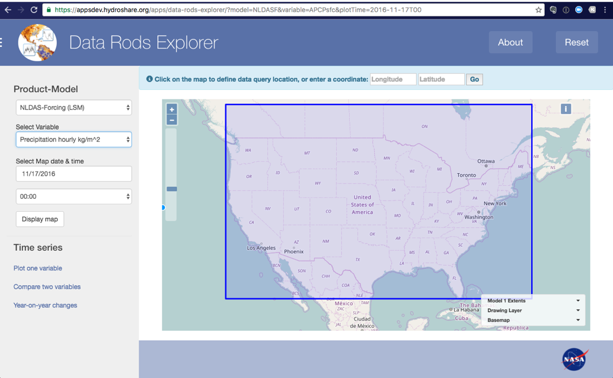

_Figure 1. DRE initial startup with defaults_

However, DRE can be started to display any given model and variable, date and time. These are all valid ways of starting DRE:

- [https://apps.hydroshare.org/apps/data-rods-explorer/](https://apps.hydroshare.org/apps/data-rods-explorer/)
- [https://apps.hydroshare.org/apps/data-rods-explorer/?model=GLDAS21](https://apps.hydroshare.org/apps/data-rods-explorer/?model=GLDAS21)
- [https://apps.hydroshare.org/apps/data-rods-explorer/?model=AMSRED&amp;variable=soil\_moisture\_c](https://apps.hydroshare.org/apps/data-rods-explorer/?model=AMSRED&amp;variable=soil_moisture_c)
- [https://apps.hydroshare.org/apps/data-rods-explorer/?model=GRACE&amp;variable=sfsm\_inst&amp;plotTime=2011-10-02T00](https://apps.hydroshare.org/apps/data-rods-explorer/?model=GRACE&amp;variable=sfsm_inst&amp;plotTime=2011-10-02T00)

Because DRE populates all pull-down lists and date-time selection fields with valid contents, it will always fill in missing parameters with default values.

**Tip**: As you start exploring NASA data availability, you may notice that some models are no longer updated (static end date), while others are continually updated but lag the current date by a few days to several weeks. This lag or latency is due to differing workflows to process the incoming spatial data for time series indexing. NLDAS variables are usually available within a few days of the current date, while GLDAS variables may lag by a month, and TRMM by more than that. Due to these variations, a script is run nightly at 3am ET to update an external file listing all the products/models&#39; data availability. You can check this file at any time here: [dates\_and\_spatial\_range.txt](https://apps.hydroshare.org/static/data_rods_explorer/data/dates_and_spatial_range.txt)

### Selecting and displaying gridded maps of model variables

To pick a model, click on the pulldown field directly below the **Product-Model** heading in the left margin panel, see Figure 2 below *(actual list may differ from this figure)*. Once the model is chosen, the list of variables is updated to match, see Figure 3. Figure 4 shows picking the date and time.

 
 
 _Figure 2. Product-Model List_ 
 
 _Figure 3. Variable List (NLDAS-Forcing model)_

 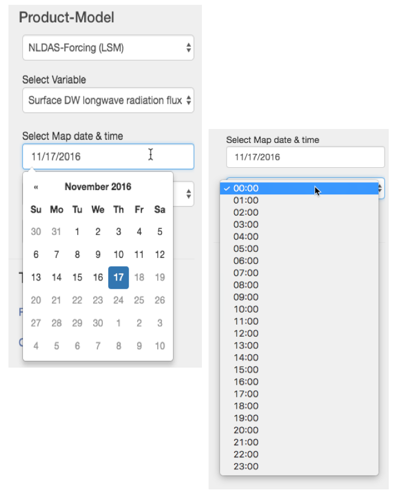 
 
 _Figure 4. Date and Time Pickers_

- Note the dates after Nov 17 in Figure 4 are grayed out; these are fenced off so the user cannot try to pick them for data (this was screen-captured on Nov 22).
- Similarly, the user can&#39;t pick a date earlier than the model&#39;s begin date as reported in [dates\_and\_spatial\_range.txt](https://apps.hydroshare.org/static/data_rods_explorer/data/dates_and_spatial_range.txt).
- **Tip**: You can edit the date directly, but if you enter a date that's out of range for the selected model, you will get an error message and the date will go blank; just click again to get the popup calendar.
See [Quickly navigating the date picker](#nav-date-picker) below for more tips.

Once the desired model, variable, date and time are all chosen, the user would click on the Display Map button. After 10-15 seconds while the NASA Giovanni server constructs the map, it is displayed.

 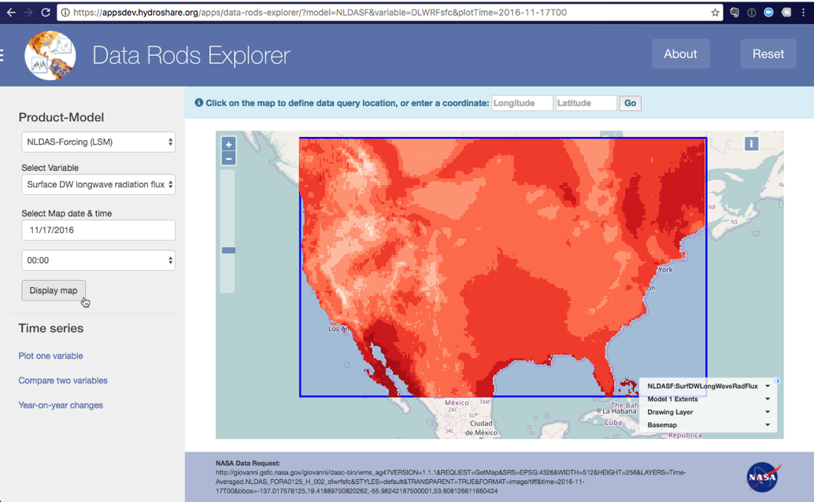

_Figure 5. Display Map of NLDAS Surface downward longwave radiation flux_

- Notice the URL at bottom of screen; this is the raw data service request sent to NASA server; you can copy/paste it into a browser tab in case you have any questions about results.
- Note the lack of color legend; see discussion and instructions for getting legend from [Giovanni](https://giovanni.gsfc.nasa.gov/giovanni).
- You can zoom into a desired area by holding down the shift key while dragging the mouse across the area of interest.
- If you zoom in or out, and want to return to the model bounds, click the mouse once on &quot;**Model 1 Extents**&quot; or &quot;**NLDASF:SurfDWLongWaveRadFlux**&quot; (or other chosen model-variable) in the map control panel in the lower-right corner of the map window.
- You can stack multiple model-variable maps by selecting additional ones; use **Reset** button to clear map layers.
- You can also hide/show and control transparency of model-variable layers; see Using the map controls panel below.

### Plotting time series of one variable

1. Display the map of a model-variable and zoom to area of interest.
2. Click on the map for a point-location for the time series (data rod), or enter a lon-lat coordinate directly in the message field, and check the dates range.
3. Click Plot one variable, then the Plot button. You can see exact values on the plot by hovering your mouse over the graph lines.
4. Notice the URL at bottom of screen; this is the raw data service request sent to NASA server; you can copy/paste it into a browser tab in case you have any questions about results.

 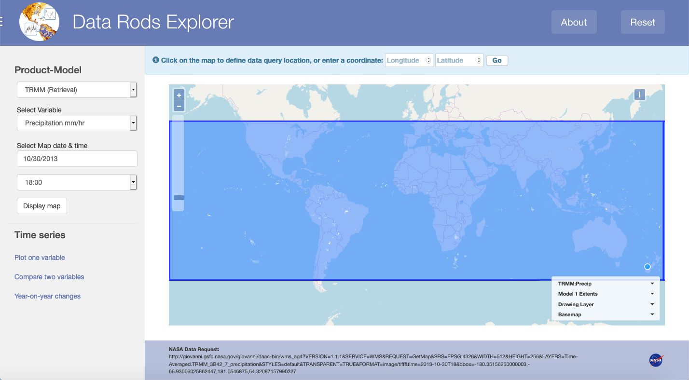
_Figure 6. TRMM Precipitation Map, Oct 30, 2013_ 

 
_Figure 7. Plot of TRMM Precipitation Time Series near Austin TX, October 2012-2013_

### Comparing time series of two variables

1. Pick a model &amp; variable in the lists just described, then click Compare two variables, and pick a second model &amp; variable. Note that **Model 2 extent** is represented by a red box on the map. Also note that the date-time pickers adjust to only allow valid times for both variables selected.
2. Click Plot button to see both plots overlaid.

 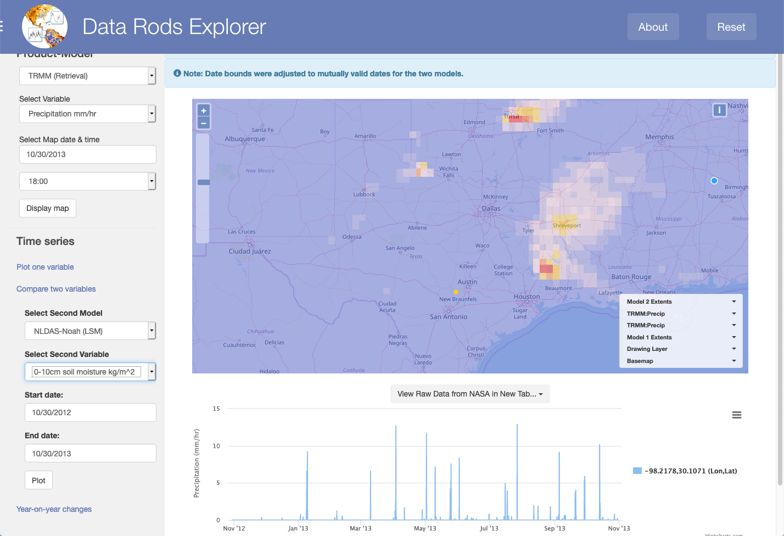 

_Figure 8. Picking second model for comparison (NLDAS 0-100cm soil moisture)_

 

_Figure 9. Model 1 plot (blue) uses left y-axis; Model 2 plot (black) uses right y-axis_

### Plotting year-on-year changes in a model variable 

For  many studies, it is useful to look at year-to-year comparisons for a particular model-variable.  This time series plotting option allows you to do that. 
1.	Pick the model and variable as shown above, then click Year-on-year changes in the Time Series options. 
2.	In the blank field under “Select years:”, click the mouse to see a popup of years available for the chosen model & variable. Click on a year, then click on the blank field again to add a second year, and so on. 

 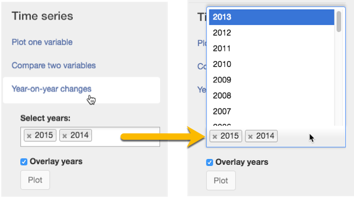
_Figure 10. Picking years for comparison_

 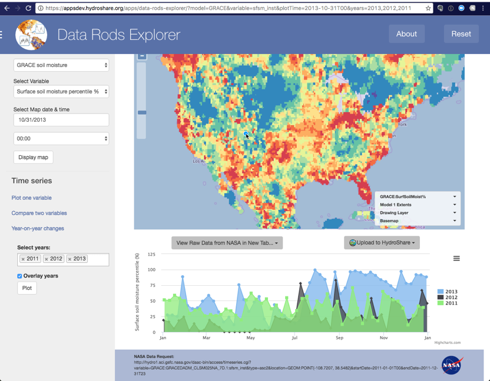
_Figure 11. Plotting Year-to-Year comparisons with GRACE soil moisture_ 

- The checkbox &quot;**Overlay years**&quot; below the year-picker overlays the data values for each calendar year chosen. Unchecking this box allows you to see each year in series on a multi-year time scale, not as an overlay.
- Note that you can show/hide individual years by clicking on them in the legend on the right.

## Using the DRE user interface tools

### Quickly navigating the date picker

The &quot;date picker&quot; is the tool that lets you pick a date for a model-variable map, or a date range for time series plots. This is a combination field: you can directly type in a date (mm/dd/yyyy format), or you can navigate to a desired date in the popup calendar. By clicking on the top-center label of the calendar popup, you can quickly change the scale of months &amp; years to browse, see examples below for NLDAS (data range = Jan 2, 1979 to the present; sampled on Nov 28, 2016).

  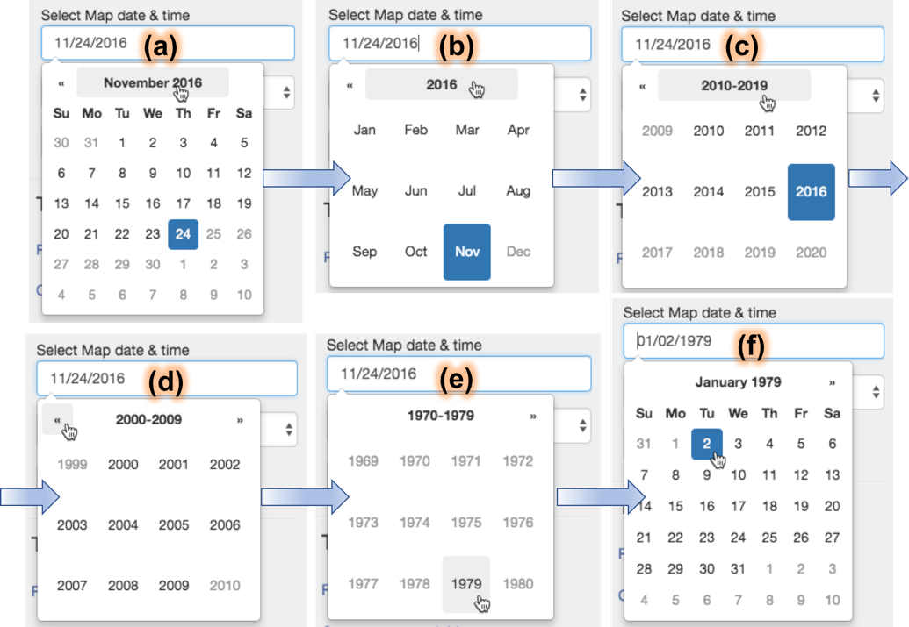

_Figure 12. Navigating Days-Months-Years in the Date Picker_

Notice that dates after Nov 24 in (a) are grayed out; this is because they are &quot;fenced off&quot; as not ready for viewing. Similarly, years prior to 1979 (e) are not available, nor are dates before Jan 2, 1979 (f).

**Tip**: You can edit the date directly, but if you enter a date that's out of range for the selected model, you will get an error message and the date will go blank; just click again to get the popup calendar.

**Tip**: Sometimes you may find that you can get a gridded variable map for a date and time, but you cannot get a time series with that end date/time. If this happens, **try changing the end-date to a day earlier, or a month earlier**. If it works then, it was possible that the time series was in the process of being updated, and was not yet indexed through the end date indicated in the NASA CMR registry.

### Using the map controls panel

As mentioned elsewhere, you can request and stack multiple model-variable grid maps. You can hide or make any of these layers transparent, to compare with an underlying layer, or to see the underlying basemap. This example reveals the underlying variable grid (GLDAS2-Evapotranspiration) through the LPRM AMSRE-D Optical Depth C-band grid layer.

 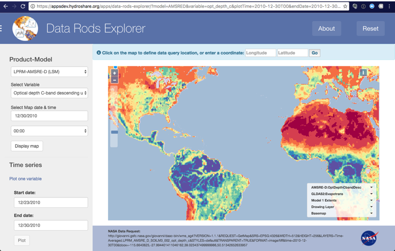

_Figure 13. LPRM-AMSRE-D Optical Depth C-band plotted over GLDAS2-Evapotranspiration_

  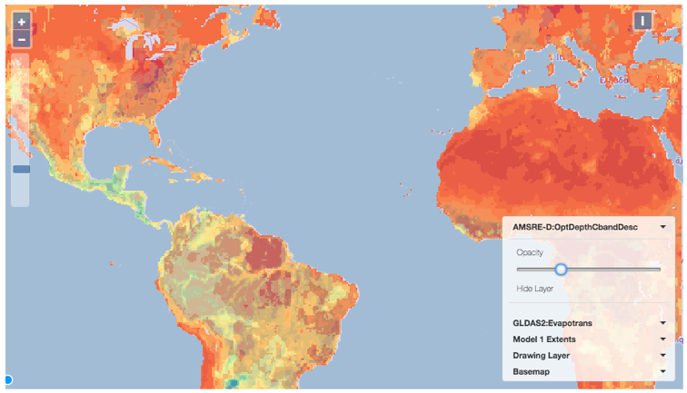

_Figure 14. Making LPRM layer transparent enough to see GLDAS2-Evapotranspiration layer_

**Note**: The **Drawing Layer** in the Map Controls Panel refers to the plot point you can place on the map, for location of the time series plots.

### Using the Reset button

The **Reset** button (upper-right of browser window) is a shortcut for clearing the model variables, dates, maps and plot graphics chosen during a session. It does this very simply by refreshing the DRE URL to the default: [https://apps.hydroshare.org/apps/data-rods-explorer](https://apps.hydroshare.org/apps/data-rods-explorer).

### Viewing / downloading time series data and plot graphics

There are a number of ways you can download the plotted time series data:

- Downloading in ASCII-text tabular format, with or without metadata
- Downloading in netCDF format
- Generating a detailed plot using the NASA plot service
- Downloading the DRE&#39;s plot image itself as JPG, PNG, SVG, or PDF

To view the exact NASA time series data with the most metadata (ie, descriptions of variable and time series) you should choose ASCII or NetCDF format from the menu button View Raw Data from NASA in New Tab… which appears between the map and the graph after plotting a time series, see Figure 15 below. The ASCII and Plot choices will display the data in a new browser tab, while the NetCDF option will open a file-download dialog to allow you to save the output.

The CSV and XLS download options shown in Figure 16 only give you the minimum data needed to draw the plot itself, that is, the table of values without descriptive metadata. The other download options in Figure 16 are to download a copy of the plot image itself in various formats.

These two approaches for downloading the plot data are both provided because the first approach leverages the NASA data services directly, while the second approach uses the [HighCharts](http://highcharts.com) plug-in tools. Most of the metadata has been discarded by the time HighCharts plots it in DRE.

 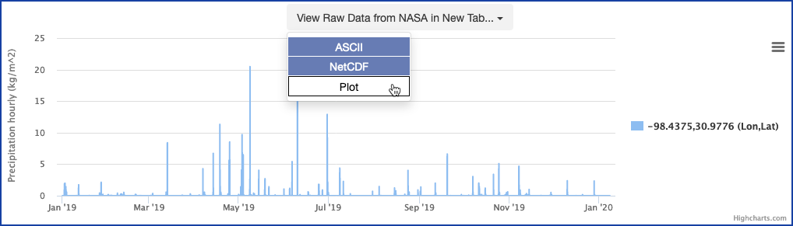

_Figure 15. Download Choices (NASA data services with metadata) for Time Series Data_

 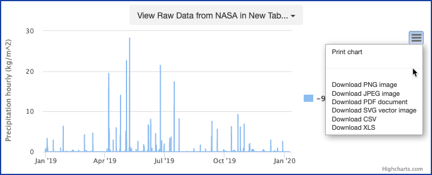

_Figure 16. Download Choices (chart only, no metadata) for Time Series Data and Plot Image_

Note: Due to virtual memory limits, PNG download files cannot exceed 20-month time periods. For instance, printing a PNG for the graph from Jan 2015 to Oct 2017 will result in an error message.

One other point to make regarding the View Raw Data choices: if your plots have two variables or year-to-year changes, then choosing to View Raw Data as ASCII, Plot or NetCDF will create multiple new browser tabs, one for each variable-time series. ****Tip****: IF YOU DON&#39;T SEE multiple new tabs, this could be due to your browser&#39;s pop-up blocker (depends on the browser). Check online for your browser&#39;s method of adding an exception to the pop-up blocker, and add an exception for the following sites:   **appsdev.hydroshare.org** , and **apps.hydroshare.org**.

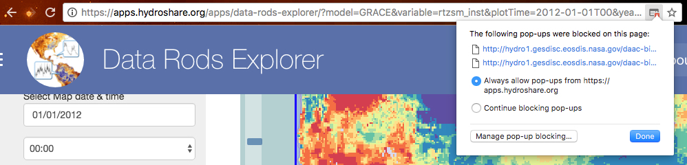

_Figure 17. Resetting your browser's popup blocker to allow multiple time series tabs (Chrome shown)_

---

## Notifications and Testing

This section lists the informational and error messages you might encounter during use.

**Tip**: See [Testing the NASA data services](#testing-services) (section below) if you want to verify which data services are online or having difficulty.

**Message 1.** Messages are displayed between the Data Rods Explorer title bar and the map frame. These are either informative instructions, or explanatory about error conditions. Informative messages are displayed with blue text against a blue background box. The following example shows the most common informative message: &quot;Click on the map to define data query location, or enter a coordinate:&quot; You don&#39;t need to define a location for mapping, just for plots.

 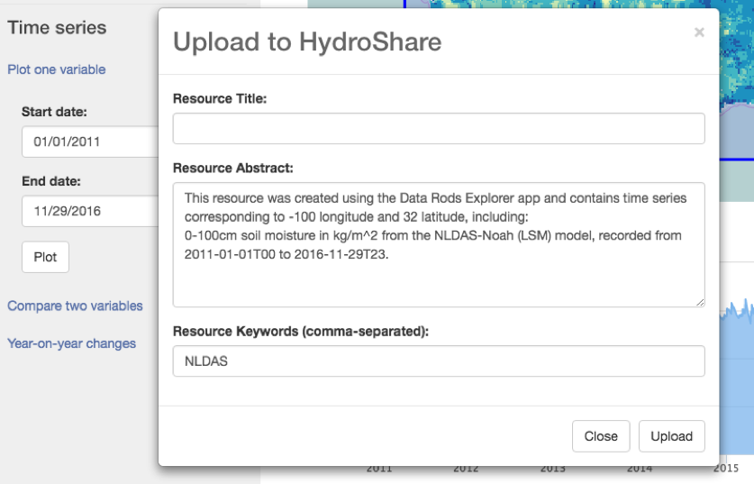

_Figure 18. User information notices_

**Message 2.** At the time of DRE development, the GLDAS model-variables were only available as time series data and plots, not as grid maps, thus the following message was displayed upon picking the GLDAS model:

 

This message can no longer occur since GLDAS 1.0 has been removed from DRE, but this message number is being kept as a placeholder in case of future use.

**Message 3.** The models made available for data rods almost all have different temporal bounds, so when you choose **Compare two variables** for plotting time series from different models, it&#39;s possible to pick a date range for one that will not work for the other. DRE checks this and adjusts the allowed date range for comparison to the mutually available bounds, and displays an info message to let you know.

 

**Message 4.** Two informative messages and one warning might accompany requests for data upload to HydroShare:

 

 
 
 

**Message 5.** Warnings and errors are displayed in brown or red text and background box, as shown here. The following messages appear if the requested map service is down, or if a map is requested out of temporal or spatial bounds.

  
 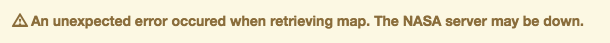 

If this message persists for a map you expect to be available, try running the NASA Data Request URL displayed at the bottom of the DRE window (see [Testing the NASA Data Services](#testing-services) section below).

**Message 6.** The following message appears when the user has clicked on the map outside the model extent.
 
If the model extent bounds are not obvious at the time you get this message, you can zoom to the model extent by clicking once on **Model 1 Extents** (or model 2) in the map control panel.
If the model extent bounds are not obvious at the time you get this message, you can zoom to the model extent by clicking once on **Model 1 Extents** (or model 2) in the map control panel.

**Message 7.** On some occasions, Error 999 might appear:

 

This can happen if you type directly in the Map Date, Start Date or End Date fields, and enter a date that is outside the range of data available from NASA. To check date validity, use the popup calendar &quot;date picker&quot;, which incorporates the valid date ranges.

This may also happen during brief periods (usually no more than a few hours) between the time the gridded map data became available, and when the data rods indexing was completed. The CMR metadata (including temporal bounds) will match the gridded data, while the data rods may not be ready. So you might be able to draw the gridded variable map, but not see the time series plot. You can try again in a few hours, or change your data request to an earlier time period.

**Message 8.** On other rare occasions, you might get the Unknown Error:

 

Try hitting the **Reset** button, and retrying your requests. If this error persists, take note of the conditions in which it occurred and contact [Gonzalo Espinoza](mailto:gespinoza@utexas.edu).

**Message 9.** Another unusual condition can arise if the temporal or spatial bounds read from the NASA CMR in the nightly **enddate\_bounds.py** cron job does not match the actual data availability at the time you try to plot a variable&#39;s time series. This is more likely when you are trying to explore the latest available data. First, try backing up a day or more on your **End date** selection for the comparison.

 

If the condition persists, take note of the conditions in which it occurred and contact [Gonzalo Espinoza](mailto:gespinoza@utexas.edu).

**Message 10.** You can edit map and plot dates directly in the text field, but if you enter a date that's out of range for the selected model, you will get an error message and the date will go blank; just click again to get the popup calendar.

 

---

## NASA References

## NASA Servers and Search Portals

Initial point of contact for NASA data-related questions is [William Teng](mailto:william.l.teng@nasa.gov). All general questions related to data rods should go to <gsfc-help-disc@lists.nasa.gov>.

### NASA Giovanni

**Giovanni** is the reference data server for all data rods: [https://disc.gsfc.nasa.gov/information/tools?title=Giovanni](https://disc.gsfc.nasa.gov/information/tools?title=Giovanni)

**Note about map legends** : It is not yet practical to request and receive a usable map legend for each model variable as it displayed in the DRE map pane. However, users can use Giovanni if it becomes important to know the meanings of the color choices in the DRE grid map displayed for each variable. For example, when you click on the link below, you are taken to a new window showing Giovanni&#39;s faceted search screen. If you click &quot;Plot&quot; at the bottom-right of the UI, you should get the same map as the displayed WMS map in DRE but with legend:

[https://giovanni.gsfc.nasa.gov/giovanni/#service=TmAvMp&starttime=2020-01-14T00:00:00Z&endtime=2020-01-14T00:00:59Z&data=NLDAS_NOAH0125_H_002_soilm0_10cm&variableFacets=dataFieldDiscipline%3AHydrology%3BdataFieldMeasurement%3ASoil%20Moisture%3B](https://giovanni.gsfc.nasa.gov/giovanni/#service=TmAvMp&starttime=2020-01-14T00:00:00Z&endtime=2020-01-14T00:00:59Z&data=NLDAS_NOAH0125_H_002_soilm0_10cm&variableFacets=dataFieldDiscipline%3AHydrology%3BdataFieldMeasurement%3ASoil%20Moisture%3B)    (tested January 20, 2020)

### NASA Global Change Master Directory (GCMD)

The [Global Change Master Directory (GCMD)](https://gcmd.nasa.gov/) is a catalog to search for Earth science data and services.

**Note**: the GCMD catalog content is being migrated to the newer CMR, see next link:

- [GCMD Portal search for datasets](https://gcmd.nasa.gov/search/Titles.do?search=#titles)

### NASA Common Metadata Repository (CMR)

The CMR is an earth science metadata repository for NASA EOSDIS data.

- CMR [Portal search](https://cmr.earthdata.nasa.gov/)
- CMR Search for [API documentation](https://cmr.earthdata.nasa.gov/search/site/search_api_docs.html)
- Example of finding end-date and bounding-box for models in CMR is in section below

## References for models and variables

Table 1. NASA Data Rods: Product / Model Characteristics

| **Data product** | **Spatial  resolution (deg)** | **Spatial coverage** | **Temporal resolution** | **Temporal coverage** | **# variables** |
| --- | --- | --- | --- | --- | --- |
| NLDAS-2 forcing | 1/8 | N.America 53N-25N | 1 hour | 1979-present | 8 |
| NLDAS-2 Noah | 1/8 | N.America 53N-25N | 1 hour | 1979-present | 13 |
| SMERGE root zone | 1/8 | N.America 53N-25N | 1 day | 1979-2016 | 2 |
| GLDAS-2.0 Noah | 1/4 | Global 90N-60S | 3 hour | 1948-2014 | 24 |
| GLDAS-2.1 Noah | 1/4 | Global 90N-60S | 3 hour | 2000-present | 15 |
| GRACE soil moisture | 1/4 | N.America 53N-25N | 7 day | 2002-present | 3 |
| LPRM-AMSRE soil moisture | 1/4 | Global | 1 day | 2002-2011 | 7-asc, 7-desc |
| LPRM-AMSR2 soil moisture | 10km; 25km | Global | 1 day | 2012-present | 1-asc, 1-desc, each resolution |
| LPRM-TMI soil moisture | 1/4 | Global | 1 day | 1997-2015 | 4-day, 4-night |
| MERRA-Land snowfall | 0.5x0.667 | Global | 1 hour | 1980-2016 | 8 |
| MERRA2 wind, radiation, forcing | 0.5x0.625 | Global | 1 hour | 1980-present | 7 |
| TRMM precipitation | 1/4 | Global 50N-50S | 3 hour | 1997-2018 | 1 |

**For details on data rods, see** : Teng, W., H. Rui, R. Strub, and B. Vollmer, 2016. Optimal reorganization of NASA earth science data for enhanced accessibility and usability for the hydrology community, _Journal of the American Water Resources Association (JAWRA),_ 52(4), 825-835, [doi:10.1111/1752-1688.12405](https://onlinelibrary.wiley.com/doi/10.1111/1752-1688.12405).

Further online references:

- [GES DISC Documentation](https://disc.gsfc.nasa.gov/information/documents?title=Hydrology%20Documentation) and [FAQ](https://disc.gsfc.nasa.gov/information/faqs?page=1&keywords=Hydrology)
- [Data Rods Time Series Reference](https://disc.gsfc.nasa.gov/information/tools?title=Hydrology%20Data%20Rods) (web)
- [Data Rods Variables Info (spreadsheet)](https://docs.google.com/spreadsheets/d/1Djq_djFupHoPnBR9NOuDYmVPwTuWmWewo8wddl6qofs/edit?ts=581ca0ca#gid=0)

**Note** that most model outputs are updated on a regular basis, though not synchronized with each other. For the exact and most current availability dates for these models, see [dates\_and\_spatial\_range.txt](https://apps.hydroshare.org/static/data_rods_explorer/data/dates_and_spatial_range.txt) which is updated by cron job nightly at 3am US ET. See related section for more details.

### LDAS - Land Data Assimilation System

**Reference URL** : [https://ldas.gsfc.nasa.gov/index.php](https://ldas.gsfc.nasa.gov/index.php)

The Land Data Assimilation System (LDAS) is a methodology for compiling hydrologic Land-Surface Models (LSMs) and forcing them with observations to remove National Weather Prediction (NWP) forcing biases. Forcings consist of precipitation gauge observations, satellite data, radar precipitation measurements, and output from numerical prediction models derived from existing Surface Vegetation Atmosphere Transfer Schemes (SVATS).

- [LDAS FAQ](https://ldas.gsfc.nasa.gov/faq), eg, &quot;is there a shapefile for the NLDAS grid?&quot; (yes)

### NLDAS - National Land Data Assimilation System, 1979-Present

**Reference URL** :

- General info: [https://ldas.gsfc.nasa.gov/nldas/](https://ldas.gsfc.nasa.gov/nldas/)
- Readme: [https://hydro1.gesdisc.eosdis.nasa.gov/data/NLDAS/README.NLDAS2.pdf](https://hydro1.gesdisc.eosdis.nasa.gov/data/NLDAS/README.NLDAS2.pdf)

**NLDAS-Forcing variables** : hourly precipitation, surface downward (DW) shortwave and longwave radiation flux, 2-m above ground specific humidity, 2-m above ground temperature, 10-m above ground zonal wind, 10-m above ground meridional wind. More details: [https://disc.gsfc.nasa.gov/datasets/NLDAS_FORA0125_H_V002/summary](https://disc.gsfc.nasa.gov/datasets/NLDAS_FORA0125_H_V002/summary)

**NLDAS-Noah v2 variables** : evapotranspiration, ground heat flux, latent heat flux, sensible heat flux, surface runoff, subsurface runoff, 0-10cm soil moisture, 10-40cm soil moisture, 40-100cm soil moisture, 0-100cm soil moisture, 100-200cm soil moisture, 0-10cm soil temperature. More details: [https://disc.gsfc.nasa.gov/datasets/NLDAS_NOAH0125_H_V002/summary](https://disc.gsfc.nasa.gov/datasets/NLDAS_NOAH0125_H_V002/summary)

**Tip**: Note that many of these variables have volume units of (kg/m^2) or rates like (kg/m^2/s). This is a convenience unit for water equivalence variables, which is the same as &quot;mm water equivalent&quot; for volumes, and mm/s for rates. See [FAQ on rain-unit](https://disc.gsfc.nasa.gov/information/faqs?keywords=Hydrology&title=How%20to%20convert%20the%20rainfall%20unit%20of%20kg%2Fm%5E2%20to%20mm%3F) for details about this conversion.

### SMERGE - NLDAS land surface model output merged with surface satellite retrievals from the European Space Agency Climate Change Initiative, 1979-2016

**Reference URL** :

- Overview and docs: [https://disc.gsfc.nasa.gov/datasets/SMERGE_RZSM0_40CM_V2.0/summary](https://disc.gsfc.nasa.gov/datasets/SMERGE_RZSM0_40CM_V2.0/summary)

**Smerge-Noah-CCI variables** : 0-40cm soil moisture, CCI derived soil moisture anomalies of 0-40 cm layer.

### GLDAS 2.0 - Global Land Data Assimilation System, 1948-2014

**Reference URLs** :

- General info: [https://ldas.gsfc.nasa.gov/gldas/](https://ldas.gsfc.nasa.gov/gldas/)
- Readme: [https://hydro1.gesdisc.eosdis.nasa.gov/data/GLDAS/GLDAS\_NOAH025\_3H.2.0/doc/README\_GLDAS2.pdf](https://hydro1.gesdisc.eosdis.nasa.gov/data/GLDAS/GLDAS_NOAH025_3H.2.0/doc/README_GLDAS2.pdf)
- [FAQ comparison of GLDAS 2.0 and 2.1](https://disc.gsfc.nasa.gov/information/faqs?keywords=gldas%202.1&title=Should%20I%20use%20GLDAS%20Version%202.0%20(GLDAS-2.0)%20or%20GLDAS%20Version%202.1%20(GLDAS-2.1)%3F)

**GLDAS-Noah v2.0 variables** : evapotranspiration, rain rate, snow rate, total precipitation rate, surface runoff, subsurface runoff, 0-10cm soil moisture, 10-40cm soil moisture, 40-100cm soil moisture, 100-200cm soil moisture, air temperature, 0-10cm soil temperature, 10-40cm soil temperature, 100-200cm soil temperature, average surface skin temperature, bare soil evaporation, wind speed, air pressure, specific humidity, downward longwave radiation flux, downward shortwave radiation flux. More details: [https://disc.gsfc.nasa.gov/datasets/GLDAS_NOAH025_3H_V2.0/summary](https://disc.gsfc.nasa.gov/datasets/GLDAS_NOAH025_3H_V2.0/summary)

**Tip**: Note that many of these variables have volume units of (kg/m^2) or rates like (kg/m^2/s). This is a convenience unit for water equivalence variables, which is the same as &quot;mm water equivalent&quot; for volumes, and mm/s for rates. See [FAQ on rain-unit](https://disc.gsfc.nasa.gov/information/faqs?keywords=Hydrology&title=How%20to%20convert%20the%20rainfall%20unit%20of%20kg%2Fm%5E2%20to%20mm%3F) for details about this conversion.

### GLDAS 2.1 - Global Land Data Assimilation System, 2000-Present

**Reference URLs** :

- General info: [https://ldas.gsfc.nasa.gov/gldas/](https://ldas.gsfc.nasa.gov/gldas/)
- Readme: [https://hydro1.gesdisc.eosdis.nasa.gov/data/GLDAS/GLDAS\_NOAH025\_3H.2.1/doc/README\_GLDAS2.pdf](https://hydro1.gesdisc.eosdis.nasa.gov/data/GLDAS/GLDAS_NOAH025_3H.2.1/doc/README_GLDAS2.pdf)
- [FAQ comparison of GLDAS 2.0 and 2.1](https://disc.gsfc.nasa.gov/information/faqs?keywords=gldas%202.1&title=Should%20I%20use%20GLDAS%20Version%202.0%20(GLDAS-2.0)%20or%20GLDAS%20Version%202.1%20(GLDAS-2.1)%3F)

**GLDAS-Noah v2.1 variables** : evapotranspiration, precipitation rate, rain rate, snow rate, surface runoff, subsurface runoff, 0-10cm soil moisture, 10-40cm soil moisture, 40-100cm soil moisture, 100-200cm soil moisture, root zone soil moisture, 0-10cm soil temperature, average surface skin temperature, near-surface air temperature, near-surface wind speed, air pressure, specific humidity. More details: [https://disc.gsfc.nasa.gov/datasets/GLDAS_NOAH025_3H_V2.1/summary](https://disc.gsfc.nasa.gov/datasets/GLDAS_NOAH025_3H_V2.1/summary)

**Tip**: Note that many of these variables have volume units of (kg/m^2) or rates like (kg/m^2/s). This is a convenience unit for water equivalence variables, which is the same as &quot;mm water equivalent&quot; for volumes, and mm/s for rates. See [FAQ on rain-unit](https://disc.gsfc.nasa.gov/information/faqs?keywords=Hydrology&title=How%20to%20convert%20the%20rainfall%20unit%20of%20kg%2Fm%5E2%20to%20mm%3F) for details about this conversion.

### GRACE - Gravity Recovery and Climate Experiment, 2002-2017

**Reference URLs** :

- General info: [https://nasagrace.unl.edu/](https://nasagrace.unl.edu/)
- Readme: [https://hydro1.gesdisc.eosdis.nasa.gov/data/GRACEDA/GRACEDADM\_CLSM0125US\_7D.2.0/doc/README\_GRACEDADM2.pdf](https://hydro1.gesdisc.eosdis.nasa.gov/data/GRACEDA/GRACEDADM_CLSM0125US_7D.2.0/doc/README_GRACEDADM2.pdf)

**GRACE variables** : 0-2 cm surface soil moisture percentile, 0-100 cm root zone soil moisture percentile, shallow groundwater percentile. More details: [https://disc.gsfc.nasa.gov/datasets/GRACEDADM_CLSM0125US_7D_V2.0/summary](https://disc.gsfc.nasa.gov/datasets/GRACEDADM_CLSM0125US_7D_V2.0/summary)

Percentile values are based on the period 1948-2012. According to the data provider, future updates will be infrequent (~3 months), but no reason to expect that this data will be removed anytime soon.  

The three GRACE variables in data rods actually are updated through the full time range: the last granule begins on a given date, and although it “represents” the drought indicators for 7 days, it is technically only daily data taken once per week (each Monday).

### LPRM - Land Parameter Retrieval Model

**Readme (all LPRM products)** :
[https://hydro1.gesdisc.eosdis.nasa.gov/data/WAOB/LPRM\_AMSR2\_A\_SOILM3.001/doc/README\_LPRM.pdf](https://hydro1.gesdisc.eosdis.nasa.gov/data/WAOB/LPRM_AMSR2_A_SOILM3.001/doc/README_LPRM.pdf)

**AMSR-E Descending/Ascending variables, 2002-2011** : soil moisture C-band percentile, soil moisture X-band percentile, soil moisture uncertainty C-band, soil moisture uncertainty X-band, optical depth C-band, optical depth X-band, 2mm skin temperature AMSRE. More details: 

- Aqua (soil moisture 25km descending): [https://disc.gsfc.nasa.gov/datasets/LPRM_AMSRE_D_SOILM3_V002/summary](https://disc.gsfc.nasa.gov/datasets/LPRM_AMSRE_D_SOILM3_V002/summary)
- Aqua (soil moisture 25km ascending): [https://disc.gsfc.nasa.gov/datasets/LPRM_AMSRE_A_SOILM3_V002/summary](https://disc.gsfc.nasa.gov/datasets/LPRM_AMSRE_A_SOILM3_V002/summary)
- Aqua (root zone with Palmer water balance 25km descending): [https://disc.gsfc.nasa.gov/datasets/LPRM_AMSRE_D_RZSM3_V001/summary](https://disc.gsfc.nasa.gov/datasets/LPRM_AMSRE_D_RZSM3_V001/summary)

This Level 3 (gridded) data set&#39;s land surface parameters, surface soil moisture, land surface (skin) temperature, and vegetation water content, are derived from passive microwave remote sensing data from the Advanced Microwave Scanning Radiometer-Earth Observing System (AMSR-E), using the Land Parameter Retrieval Model (LPRM). There are two files per day, one ascending (daytime) and one descending (nighttime), archived as two different products. The data set covers the period from June 2002 to October 2011 (when the AMSR-E on the NASA EOS Aqua satellite stopped producing data due to a problem with the rotation of its antenna), at a spatial resolution of 0.25 degree. The data are stored in netCDF format.

**AMSR2 Descending/Ascending variables, 2012-Present** : AMSR2/GCOM-W1 surface soil moisture (LPRM) L3 1 day 25 km x 25 km and 10 km x 10 km V001 are Level 3 (gridded) data sets. Their land surface parameters, surface soil moisture, land surface (skin) temperature, and vegetation water content, are derived from passive microwave remote sensing data from the Advanced Microwave Scanning Radiometer 2 (AMSR2), using the Land Parameter Retrieval Model (LPRM). There are two files per day for each spatial resolution, one ascending (daytime) and one descending (nighttime), archived as two different products. The data set covers the period from May 2012, when the Japan Aerospace Exploration Agency (JAXA) Global Change Observation Mission-1st Water GCOM-W1 satellite was launched, to the present. More details: 

- GCOM (soil moisture 25km ascending): [https://disc.gsfc.nasa.gov/datasets/LPRM_AMSR2_A_SOILM3_V001/summary](https://disc.gsfc.nasa.gov/datasets/LPRM_AMSR2_A_SOILM3_V001/summary)
- GCOM (soil moisture 25km descending): [https://disc.gsfc.nasa.gov/datasets/LPRM_AMSR2_D_SOILM3_V001/summary](https://disc.gsfc.nasa.gov/datasets/LPRM_AMSR2_D_SOILM3_V001/summary)
- GCOM (soil moisture 10km ascending): [https://disc.gsfc.nasa.gov/datasets/LPRM_AMSR2_DS_A_SOILM3_V001/summary](https://disc.gsfc.nasa.gov/datasets/LPRM_AMSR2_DS_A_SOILM3_V001/summary)
- GCOM (soil moisture 10km descending): [https://disc.gsfc.nasa.gov/datasets/LPRM_AMSR2_DS_D_SOILM3_V001/summary](https://disc.gsfc.nasa.gov/datasets/LPRM_AMSR2_DS_D_SOILM3_V001/summary)

The LPRM is based on a forward radiative transfer model to retrieve surface soil moisture and vegetation optical depth. The land surface temperature is derived separately from the AMSR2's Ka-band (36.5 GHz). A unique feature of this method is that it can be applied at any microwave frequency, making it very suitable to exploit all the available passive microwave data from various satellites.

**TMI Day/Night variables, 1998-2015** : TMI/TRMM surface soil moisture (LPRM) L3 1 day 25 km x 25 km daytime and nighttime V001 are Level 3 (gridded) data sets. Their land surface parameters, surface soil moisture, land surface (skin) temperature, and vegetation water content, are derived from passive microwave remote sensing data from the Tropical Rainfall Measuring Mission (TRMM) Microwave Imager (TMI), using the Land Parameter Retrieval Model (LPRM). There are two files per day, one daytime and one nighttime, archived as two different products. The data set covers the period from December 1997 to April 2015 (when the instruments on the TRMM satellite were shut down in preparation for its reentry into the earth's atmosphere). More details: [https://disc.gsfc.nasa.gov/datasets/LPRM_TMI_NT_SOILM3_V001/summary](https://disc.gsfc.nasa.gov/datasets/LPRM_TMI_NT_SOILM3_V001/summary)

The LPRM is based on a forward radiative transfer model to retrieve surface soil moisture and vegetation optical depth. The land surface temperature is derived separately from TMI's Ka-band (37 GHz). A unique feature of this method is that it can be applied at any microwave frequency, making it very suitable to exploit all the available passive microwave data from various satellites.

###  MERRA-Land and MERRA2
Land Surface Model suite of surface hydrology variables, similar to LDAS. Many more MERRA variables are developed, but not yet as time-series data cubes. 

**MERRA-Land Readme** :
[https://goldsmr2.gesdisc.eosdis.nasa.gov/data/MERRA/MST1NXMLD.5.2.0/doc/MERRA.README.pdf](https://goldsmr2.gesdisc.eosdis.nasa.gov/data/MERRA/MST1NXMLD.5.2.0/doc/MERRA.README.pdf)

**MERRA-Land variables, 1980-2016** : surface snowfall, top soil layer soil moisture, latent heat flux from land, total surface precipitation, sensible heat flux from land, baseflow runoff, overland runoff, soil temperature in layer 1. More details: [https://disc.gsfc.nasa.gov/datasets/MST1NXMLD_V5.2.0/summary](https://disc.gsfc.nasa.gov/datasets/MST1NXMLD_V5.2.0/summary)

**MERRA2 Readme** :
[https://goldsmr4.gesdisc.eosdis.nasa.gov/data/MERRA2/M2T1NXFLX.5.12.4/doc/MERRA2.README.pdf](https://goldsmr4.gesdisc.eosdis.nasa.gov/data/MERRA2/M2T1NXFLX.5.12.4/doc/MERRA2.README.pdf)

**MERRA2 variables, 1980-Present** : time-average surface northward wind, surface eastward wind, surface absorbed longwave radiation, incident shortwave radiation land, surface specific humidity, land surface air temperature, surface wind speed. More details: 

- Forcings, instantaneous: [https://disc.gsfc.nasa.gov/datasets/M2I1NXLFO_V5.12.4/summary](https://disc.gsfc.nasa.gov/datasets/M2I1NXLFO_V5.12.4/summary)
- Forcings, time-averaged: [https://disc.gsfc.nasa.gov/datasets/M2T1NXLFO_V5.12.4/summary](https://disc.gsfc.nasa.gov/datasets/M2T1NXLFO_V5.12.4/summary)
- Surface flux diagnotics, time-averaged: [https://disc.gsfc.nasa.gov/datasets/M2T1NXFLX_V5.12.4/summary](https://disc.gsfc.nasa.gov/datasets/M2T1NXFLX_V5.12.4/summary)

### TRMM - Tropical Rainfall Measuring Mission, 1998-2018

**Reference URL** : [https://trmm.gsfc.nasa.gov/](https://trmm.gsfc.nasa.gov/)

The TRMM satellite, a joint mission between the National Aeronautics and Space Administration (NASA) and the Japan Aerospace Exploration Agency (JAXA), collected 17 years of global tropical rainfall and lightning data since December 1997 and April 2015. While the satellite came down in April 2015, the TRMM product 3B42, from which data rods are generated, continues. 3B42 v7 is a merged product, so, even without TRMM inputs, the product continues with other inputs. More details: [https://disc.gsfc.nasa.gov/datasets/TRMM_3B42_V7/summary](https://disc.gsfc.nasa.gov/datasets/TRMM_3B42_V7/summary)

TRMM is now a static product. For RT precipitation, we will add GPM ([Global Precipitation Measurement](https://www.nasa.gov/mission_pages/GPM/main/index.html)) (TBD)

---

## Keeping DRE Up to Date

These two sections, **Keeping DRE Up to Date** and **[DRE App Process Flow](#dre-app-flow)** , are for NASA staff and other researchers/developers wanting to help maintain this app. This includes making changes in the model configurations, and understanding the program logic.

### Using the NASA Data Rods Variables Info spreadsheet

The [NASA Data Rods Variables spreadsheet](https://docs.google.com/spreadsheets/d/1Djq_djFupHoPnBR9NOuDYmVPwTuWmWewo8wddl6qofs/edit?ts=581ca0ca#gid=0) is maintained by NASA GES-DISC staff, and provides the basic information to be used within DRE for all data server requests. Initial point of contact for NASA data-related questions is [William Teng](mailto:william.l.teng@nasa.gov). All general questions related to data rods should go to <gsfc-help-disc@lists.nasa.gov>.

### Reading and editing the model\_config.txt file

The [model\_config.txt](https://github.com/gespinoza/datarodsexplorer/blob/master/tethysapp/data_rods_explorer/public/data/model_config.txt) file is manually constructed with care, based on content in the [NASA Data Rods Variables spreadsheet](https://docs.google.com/spreadsheets/d/1Djq_djFupHoPnBR9NOuDYmVPwTuWmWewo8wddl6qofs/edit?ts=581ca0ca#gid=0) mentioned above. This provides a configuration specification for each model and variable, which enables constructing queries to the NASA Common Metadata Repository (CMR) and to the Giovanni data server at the user&#39;s direction, for all purposes of the DRE. This only needs to be updated if something changes about the NASA CMR or data servers, or if there are more models and/or variables to be described. Any such changes from NASA should be communicated and confirmed by means of the [NASA Data Rods Variables spreadsheet](https://docs.google.com/spreadsheets/d/1Djq_djFupHoPnBR9NOuDYmVPwTuWmWewo8wddl6qofs/edit?ts=581ca0ca#gid=0). 

**Note** there are two copies of model\_config.txt: [one in GitHub](https://github.com/gespinoza/datarodsexplorer/blob/master/tethysapp/data_rods_explorer/public/data/model_config.txt), which the DRE app uses at runtime, and [a second one on the HydroShare apps server](https://apps.hydroshare.org/static/data_rods_explorer/data/model_config.txt), which is used in the nightly cron job to update the [dates\_and\_spatial\_range.txt](https://apps.hydroshare.org/static/data_rods_explorer/data/dates_and_spatial_range.txt) file (also on the HydroShare apps server). The benefit of having the runtime app use the model\_config.txt on GitHub is that the variables can be edited and tested without having to sync the server version with the GitHub version. But if there are changes to model parameters such as model name, version, or URL template for requests, then the GitHub and server versions of model\_config.txt must by sync'd. This is done by a request to <dev@hydroshare.org>. 

We will look at the 2-line header block and the first model in the [model\_config.txt](https://github.com/gespinoza/datarodsexplorer/blob/master/tethysapp/data_rods_explorer/public/data/model_config.txt) file, as of Nov 1, 2018. The top line in the header block identifies the model-specific content (with &quot;~&quot; field separator character), such as to generate the dates\_and\_spatial\_range.txt content. The second line in the header block identifies the variable-specific details (with &quot;|&quot; field separator character) needed for run-time data queries with each model. 

    Model_Display_Name~Model_Key_Name~Official_Model_Short_Name~Model_Version~Model_Data_Url_Pattern
    Model_Key|Data_Rods_Variable_ID|WMS_Layer_Name|Variable_Dropdown_Name|Units|Variable_Layer_Name

Below these header lines, each model block is preceded by a blank line. The first line in each model block defines the model identifiers and the data service endpoint URL template. Note the use of placeholders {0} for the model variable identifier, {1} for the location coordinates, {2} for the start date, and {3} for the end date. These are all filled in through user selections while running DRE.

    NLDAS-Forcing (LSM)~NLDASF~NLDAS_FORA0125_H~002~http://hydro1.sci.gsfc.nasa.gov/daac-bin/access/timeseries.cgi?variable=NLDAS:NLDAS_FORA0125_H.002:{0}&amp;type=asc2&amp;location=GEOM:POINT({1})&amp;startDate={2}&amp;endDate={3}

The remaining lines for each model block define each variable, using the vertical bar &quot;|&quot; character as a field separator. These fields provide the content that shows in the data rods URL placeholder {0}, in model and variable pulldowns, in the map controls, and in time series plots (labels and units).

    NLDASF|APCPsfc|NLDAS_FORA0125_H_002_apcpsfc|Precipitation hourly|kg/m^2|NLDASF:PrecipHourly
    NLDASF|DLWRFsfc|NLDAS_FORA0125_H_002_dlwrfsfc|Surface DW longwave radiation flux|W/m^2|NLDASF:SurfDWLongWaveRadFlux
    NLDASF|DSWRFsfc|NLDAS_FORA0125_H_002_dswrfsfc|Surface DW shortwave radiation flux|W/m^2|NLDASF:SurfDWShrtWaveRadFlux
    NLDASF|SPFH2m|NLDAS_FORA0125_H_002_spfh2m|2-m above ground specific humidity|kg/kg|NLDASF:2mAbvGrndSpecifHumid
    NLDASF|TMP2m|NLDAS_FORA0125_H_002_tmp2m|2-m above ground temperature|K|NLDASF:2mAbvGrndTemp
    NLDASF|UGRD10m|NLDAS_FORA0125_H_002_ugrd10m|10-m above ground zonal wind|m/s|NLDASF:10mAbvGrndZonalWind
    NLDASF|VGRD10m|NLDAS_FORA0125_H_002_vgrd10m|10-m above ground meridional wind|m/s|NLDASF:10mAbvGrndMeridWind

### Running the enddate\_bounds.py script (cron job)

Each night at 3am US Eastern Time, a cron job executes [enddate\_bounds.py](https://github.com/gespinoza/datarodsexplorer/blob/master/tethysapp/data_rods_explorer/enddate_bounds.py), which parses the [model\_config.txt on HydroShare apps server](https://apps.hydroshare.org/static/data_rods_explorer/data/model_config.txt) file, and builds URLs to query the NASA Common Metadata Repository (CMR) for the spatial and temporal bounds for each model&#39;s datasets. This is a multi-step procedure:

**Step 1.** Read the [model\_config.txt on HydroShare apps server](https://apps.hydroshare.org/static/data_rods_explorer/data/model_config.txt) file and construct two CMR requests (begin date &amp; end date) for each model. Here are the current initial queries to CMR for the end dates of each model. Note that **&amp;sort\_key=start\_date** gets the begin date, and **&amp;sort\_key=-start\_date** gets the end date. Here are the end-date requests for all current models:

- NLDAS Forcings: [https://cmr.earthdata.nasa.gov/search/granules?short\_name=NLDAS\_FORA0125\_H&amp;version=002&amp;page\_size=1&amp;sort\_key=-start\_date](https://cmr.earthdata.nasa.gov/search/granules?short_name=NLDAS_FORA0125_H&version=002&page_size=1&sort_key=-start_date)
    
- NLDAS: [https://cmr.earthdata.nasa.gov/search/granules?short\_name=NLDAS\_NOAH0125\_H&amp;version=002&amp;page\_size=1&amp;sort\_key=-start\_date](https://cmr.earthdata.nasa.gov/search/granules?short_name=NLDAS_NOAH0125_H&version=002&page_size=1&sort_key=-start_date)
    
- GLDAS 2.0: [https://cmr.earthdata.nasa.gov/search/granules?short\_name=GLDAS\_NOAH025\_3H&amp;version=2.0&amp;page\_size=1&amp;sort\_key=-start\_date](https://cmr.earthdata.nasa.gov/search/granules?short_name=GLDAS_NOAH025_3H&version=2.0&page_size=1&sort_key=-start_date)
    
- GLDAS 2.1: [https://cmr.earthdata.nasa.gov/search/granules?short\_name=GLDAS\_NOAH025\_3H&amp;version=2.1&amp;page\_size=1&amp;sort\_key=-start\_date](https://cmr.earthdata.nasa.gov/search/granules?short_name=GLDAS_NOAH025_3H&version=2.1&page_size=1&sort_key=-start_date)
    
- LPRM AMSRE-Descending: [https://cmr.earthdata.nasa.gov/search/granules?short\_name=LPRM\_AMSRE\_D\_SOILM3&amp;version=002&amp;page\_size=1&amp;sort\_key=-start\_date](https://cmr.earthdata.nasa.gov/search/granules?short_name=LPRM_AMSRE_D_SOILM3&version=002&page_size=1&sort_key=-start_date)
    
- LPRM AMSRE-Ascending: [https://cmr.earthdata.nasa.gov/search/granules?short\_name=LPRM\_AMSRE\_A\_SOILM3&amp;version=002&amp;page\_size=1&amp;sort\_key=-start\_date](https://cmr.earthdata.nasa.gov/search/granules?short_name=LPRM_AMSRE_A_SOILM3&version=002&page_size=1&sort_key=-start_date)
    
- LPRM AMSR2-Desc 10km: [https://cmr.earthdata.nasa.gov/search/granules?short\_name=LPRM\_AMSR2\_DS\_D\_SOILM3&amp;version=001&amp;page\_size=1&amp;sort\_key=-start\_date](https://cmr.earthdata.nasa.gov/search/granules?short_name=LPRM_AMSR2_DS_D_SOILM3&version=001&page_size=1&sort_key=-start_date)
    
- LPRM AMSR2-Asc 10km: [https://cmr.earthdata.nasa.gov/search/granules?short\_name=LPRM\_AMSR2\_DS\_A\_SOILM3&amp;version=001&amp;page\_size=1&amp;sort\_key=-start\_date](https://cmr.earthdata.nasa.gov/search/granules?short_name=LPRM_AMSR2_DS_A_SOILM3&version=001&page_size=1&sort_key=-start_date)
    
- LPRM AMSR2-Desc 25km: [https://cmr.earthdata.nasa.gov/search/granules?short\_name=LPRM\_AMSR2\_D\_SOILM3&amp;version=001&amp;page\_size=1&amp;sort\_key=-start\_date](https://cmr.earthdata.nasa.gov/search/granules?short_name=LPRM_AMSR2_D_SOILM3&version=001&page_size=1&sort_key=-start_date)
    
- LPRM AMSR2-Asc 25km: [https://cmr.earthdata.nasa.gov/search/granules?short\_name=LPRM\_AMSR2\_A\_SOILM3&amp;version=001&amp;page\_size=1&amp;sort\_key=-start\_date](https://cmr.earthdata.nasa.gov/search/granules?short_name=LPRM_AMSR2_A_SOILM3&version=001&page_size=1&sort_key=-start_date)
    
- LPRM TMI-Day: [https://cmr.earthdata.nasa.gov/search/granules?short\_name=LPRM\_TMI\_DY\_SOILM3&amp;version=001&amp;page\_size=1&amp;sort\_key=-start\_date](https://cmr.earthdata.nasa.gov/search/granules?short_name=LPRM_TMI_DY_SOILM3&version=001&page_size=1&sort_key=-start_date)
    
- LPRM TMI-Night: [https://cmr.earthdata.nasa.gov/search/granules?short\_name=LPRM\_TMI\_NT\_SOILM3&amp;version=001&amp;page\_size=1&amp;sort\_key=-start\_date](https://cmr.earthdata.nasa.gov/search/granules?short_name=LPRM_TMI_NT_SOILM3&version=001&page_size=1&sort_key=-start_date)
    
- TRMM: [https://cmr.earthdata.nasa.gov/search/granules?short\_name=TRMM\_3B42&amp;version=7&amp;page\_size=1&amp;sort\_key=-start\_date](https://cmr.earthdata.nasa.gov/search/granules?short_name=TRMM_3B42&version=7&page_size=1&sort_key=-start_date)
    
- GRACE: [https://cmr.earthdata.nasa.gov/search/granules?short\_name=GRACEDADM\_CLSM0125US\_7D&amp;version=2.0&amp;page\_size=1&amp;sort\_key=-start\_date](https://cmr.earthdata.nasa.gov/search/granules?short_name=GRACEDADM_CLSM0125US_7D&version=2.0&page_size=1&sort_key=-start_date)

**Step 2.** The CMR queries each get a short XML response, which contains the URL for  the model&#39;s first granule (for begin date) or the last granule (for end date).
**Step 3.** Enddates\_bounds.py then sends these two URLs for each model, and parses the relevant dates from the respective granules. The spatial extent is included with the temporal bounds.
**Step 4.** The dates and spatial extents are written out to [dates\_and\_spatial\_range.txt](https://apps.hydroshare.org/static/data_rods_explorer/data/dates_and_spatial_range.txt).

Here is the output for the NLDAS-Noah begin-date query (the others are essentially the same):

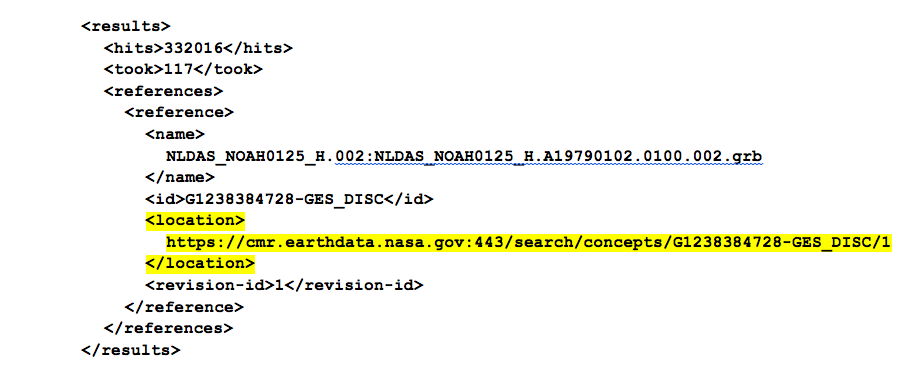

Visiting the URL in the highlighted text above results in a text file download with the following xml content:

 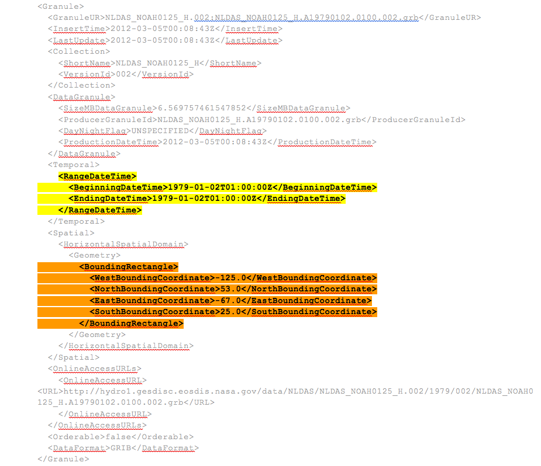

The yellow highlight in this last XML file contains the beginning date and time of the NLDAS-Noah model outputs (all variables). The orange highlight contains the spatial bounds.

Here is a sample output of enddates\_bounds.py on 30-Oct-2018, stored in [dates\_and\_spatial\_range.txt](https://apps.hydroshare.org/static/data_rods_explorer/data/dates_and_spatial_range.txt)

    Model name | Begin time | End time | N , E , S , W bounds
    NLDASF|01/01/1979 13:00:00|10/26/2018 12:00:00|53.0, -67.0, 25.0, -125.0
    NLDAS|01/02/1979 01:00:00|10/26/2018 00:00:00|53.0, -67.0, 25.0, -125.0
    GLDAS20|01/01/1948 03:00:00|12/31/2010 21:00:00|90.0, 180.0, -60.0, -180.0
    GLDAS21|01/01/2000 03:00:00|09/30/2018 21:00:00|90.0, 180.0, -60.0, -180.0
    AMSRED|06/19/2002 00:29:47|10/03/2011 21:49:11|90.0, 180.0, -90.0, -180.0
    AMSREA|06/19/2002 01:19:10|10/03/2011 20:59:52|90.0, 180.0, -90.0, -180.0
    AMSR2D10|07/03/2012 00:57:31|10/29/2018 23:30:50|90.0, 180.0, -90.0, -180.0
    AMSR2A10|07/03/2012 00:08:00|10/30/2018 00:20:19|90.0, 180.0, -90.0, -180.0
    AMSR2D25|07/03/2012 00:57:31|10/29/2018 23:30:50|90.0, 180.0, -90.0, -180.0
    AMSR2A25|07/03/2012 00:57:31|10/29/2018 23:30:50|90.0, 180.0, -90.0, -180.0
    TMIDY|12/07/1997 23:57:18|04/08/2015 15:25:03|40.0, 180.0, -40.0, -180.0
    TMINT|12/07/1997 23:57:18|04/08/2015 15:25:03|40.0, 180.0, -40.0, -180.0
    TRMM|12/31/1997 22:30:00|07/31/2018 22:29:59|50.0, 180.0, -50.0, -180.0
    MERRA|01/01/1980 00:00:00|02/29/2016 23:59:59|90.0, 180.0, -90.0, -180.0
    MERRA2X|01/01/1980 00:00:00|09/30/2018 23:59:59|90.0, 180.0, -90.0, -180.0
    MERRA2F|01/01/1980 00:00:00|09/30/2018 23:59:59|90.0, 180.0, -90.0, -180.0
    GRACE|04/01/2002 00:00:00|09/03/2017 23:59:59|53.0, -67.0, 25.0, -125.0

The NLDAS bounds found in the previous XML outputs appear on the second line of this file. Note that the end-date for NLDAS came from a separate CMR query, with **&amp;sort\_key=-start\_date**.

### Synchronization issues between the NASA CMR metadata and actual Data Rods availability

Some of the NASA models accessible through DRE are in ongoing development (NLDAS, GLDAS, TRMM), while others are completed and won&#39;t continue to change. However, several more models and variables will be added by 2017, so we will be keeping up with those as well. The model datasets provided for DRE have all been specially organized for gridded map &amp; time series access via the NASA Giovanni data server. Whenever the data rods services for NLDAS, GLDAS and TRMM are being updated, there is a window of time from a few hours to a few days, in which the CMR metadata for the original gridded data is not in sync with the data rods services, ie, the data rods may lag the source data. During these times, when we run the enddates\_bounds.py cron job to update the dates\_and\_spatial\_range.txt file, the DRE can think it has more recent data for some models than it actually has.

For this reason, before periods where you might conduct a significant level of browsing, plotting, downloads, or especially demonstrations for an audience, it is always a good idea to test and verify the data rods available date ranges and data service health using the DRE [unit\_tests.py](https://github.com/gespinoza/datarodsexplorer/blob/master/tethysapp/data_rods_explorer/tests/unit_tests.py) utility developed by Shawn Crawley. See [Testing the NASA data services](#testing-services) section for details.

---

## DRE App Process Flow

This portion of the guide is intended to help software developers understand the main events and sequences of program flow. It is very important for future developers to keep this up to date when changing or adding functionality, by versioning in the [DRE github repo](https://github.com/gespinoza/datarodsexplorer).

Two important data files mentioned below are the [model\_config.txt](https://github.com/gespinoza/datarodsexplorer/blob/master/tethysapp/data_rods_explorer/public/data/model_config.txt) and [dates\_and\_spatial\_range.txt](https://apps.hydroshare.org/static/data_rods_explorer/data/dates_and_spatial_range.txt). The model\_config.txt is maintained and accessed in the [github repo](https://github.com/gespinoza/datarodsexplorer/tree/master/tethysapp/data_rods_explorer/public/data), but the github version of dates\_and\_spatial\_range.txt is typically out of date, since this file is updated by nightly cron job. It is maintained in [https://apps.hydroshare.org/static/data\_rods\_explorer/data/dates\_and\_spatial\_range.txt](https://apps.hydroshare.org/static/data_rods_explorer/data/dates_and_spatial_range.txt).

### User opens the Data Rods Explorer app

1. The &quot;home&quot; function in controllers.py is called
  1. The model\_config.txt file is parsed and stored in global python variables
  2. The dates\_and\_spatial\_range.txt file is parsed for the spatial and temporal fences and stored in global variables
  3. The Tethys Gizmos for the user inputs are all defined
    1. Map view
    2. Date selectors
    3. Plot buttons
    4. Model selectors
    5. Year selectors
  4. All previously mentioned variables and Gizmos are passed in the context variable to the Django render function
    1. This function parses the app\_base\_dre.html file, and replaces all of the django bracket context variable indicators {{ }} with their corresponding context variable.
2. The Django-rendered app\_base\_dre.html is loaded into the browser window, parsed and processed to be loaded as the app&#39;s home page
3. All JavaScript &lt;script&gt; tags in app\_base\_dre.html are loaded:
4. The main.js script has an &quot;on page ready&quot; listener (denoted by $(function(){}) which fires and does the following:
  1. Modifies page styling (CSS)
  2. Adds a &quot;singleclick&quot; event listener to the map
  3. Adds listeners to automatically resize/redraw the map when page size changes
  4. Programs the &quot;Reset&quot; button through a &quot;click&quot; listener
5. At the bottom of app\_base\_dre.html, some &lt;script&gt; tags contain embedded JavaScript code that does the following:
  1. Receives the global config variables from the context and sets them as global JavaScript variables in the model\_objects.js script
  2. Calls the loadDefaultHome function from load\_pages.js, which does the following:
    1. Parses URL for parameters specifying selected models, variables, and dates
    2. Either sets the corresponding inputs based on what is in the URL, or if nothing is in the URL, default values are set in the inputs and the URL
    3. Loads the model 1 extents layer onto the map, which shows the boundaries for which the current model are valid

### User clicks on any of the Time Series plot options (Plot one variable, Compare two variables, or Year-on-year changes)

1. The &quot;onClickLink&quot; function from load\_pages.js is called, which does the following:
  1. Either shows or hides the user inputs for the option clicked (shows if hidden, hides if shown)
  2. Hides all other user inputs for options not clicked so only one set of inputs is showing. This was mainly done so only one &quot;Plot&quot; button is showing at a time.
  3. Adds or removes the Model 2 extents layer on the map depending on whether the &quot;Compare two variables&quot; was clicked to show/activate the user inputs, or hide them
  4. Based on the option selected, the default values from the user inputs are set and then reflected in the URL

### User chooses a different model from the model dropdown

1. The corresponding on-change function (oc\_model, oc\_model2) from on\_change.js is called, which does the following:
  1. The change is reflected in the corresponding URL parameter
  2. The global model fences variable is checked for both the spatial and temporal bounds
  3. The temporal bounds are updated for the date pickers (disabling dates outside of the bounds)
  4. The model extents are redrawn to reflect the spatial bounds

### User chooses different variable/dates/time from a dropdown

1. The corresponding on-change function (oc\_variable, oc\_years) from on\_change.js is called, which does the following:
  1. The change is reflected in the corresponding URL parameter

### User clicks on the map

1. The map&#39;s &quot;singleclick&quot; event listener registered in main.js is fired and does the following:
  1. Removes any previously drawn point, and then draws a new one at the clicked location
  2. Sets a hidden location input to the lon/lat coordinates of the clicked point
  3. Checks if the click was made within the extent fences
    1. An error is thrown if the click is outside of the model extents and the plot buttons are disabled
    2. Plot buttons are enabled if the click point is valid

### User clicks the &quot;Display Map&quot; button

1. The &quot;load\_map&quot; function from helpers.js is called, which does the following:
  1. Parses parameters (corresponding to currently selected model/variable/plotTime) from the URL
  2. Sets a number of hidden form inputs to reflect the map&#39;s current configuration (zoom level, center x and y, and extents)
  3. Serializes the form inputs
  4. Makes a &quot;POST&quot; AJAX call with the serialized form inputs to the map python controller url-mapping corresponding to the &quot;get\_map\_layer&quot; function in controllers.py
2. The &quot;get\_map\_layer&quot; function in controllers.py is called and does the following:
  1. Extracts parameters (those that were passed with the AJAX call) from the request object
  2. Assembles a NASA request URL that points to a TIFF image of the layer as defined by the request parameters
  3. The tiff image is zipped in a temporary directory
  4. The temporary zipped tiff image is uploaded to GeoServer as a new WMS layer
  5. The corresponding layer name and geoserver url are returned to the awaiting AJAX success function within the &quot;load\_map&quot; function in helpers.js
3. The AJAX success function does the following:
  1. Creates a new WMSTile layer using the OpenLayers API
  2. Adds the layer to the map and legend

### User clicks the &quot;Plot&quot; button for &quot;Plot one variable&quot;

1. The &quot;createPlot&quot; function in helpers.js is called, which does the following:
  1. Sets a number of hidden inputs to reflect the map&#39;s current configuration (zoom level, center x and y, and extents
  2. Serializes the form inputs
  3. Makes a &quot;POST&quot; AJAX call with the serialized form inputs to the map python controller url-mapping corresponding to the &quot;plot&quot; function in controllers.py
2. The &quot;plot&quot; function in controllers.py is called and does the following:
  1. Extracts parameters (those that were passed with the AJAX call) from the request object
  2. Assembles a NASA request URL that points to an ascii file of the time series data corresponding to the requested parameters
  3. Retrieves the ascii data and parses the time/value pairs out of it
  4. Configures a Time Series plot view Tethys Gizmo to show the time/value pairs
  5. Configures a url dictionary that provides URL endpoints to the ascii data, a NASA plot of the data, and a potential (future) WaterML download of the data
  6. Sets the time series Gizmo and url dictionary to the context variable
  7. Django-renders the plot.html page, which parses it and replaces all Django context variable indicators with the values of the corresponding context variables
  8. Returns the django-rendered plot.html HTML string to the awaiting AJAX success call within the &quot;load\_map&quot; function in helpers.js
3. The AJAX success function does the following:
  1. Initializes/renders the time series plot view Tethys Gizmo with the HighCharts API

### User clicks the &quot;Plot&quot; button for &quot;Compare two variables&quot;

1. Same as step 1 of &quot;Plot one variable &#39;Plot&#39; button is clicked&quot;
2. Same as step 2 of &quot;Plot one variable &#39;Plot&#39; button is clicked&quot;, except steps 2b and 2c happen for now for two separate model/variable NASA URL endpoints resulting in two distinct time series.
3. The AJAX success function does the following:
  1. Initializes/renders the time series plot view Tethys Gizmo with the HighCharts API
  2. Calls a &quot;two\_axis\_plot&quot; function which modifies the time series plot to display two distinct axes for the separate time series

### User clicks the &quot;Plot&quot; button for &quot;Year-on-year changes&quot;

1. Same as step 1 of &quot;Plot one variable &#39;Plot&#39; button is clicked&quot;
2. Same as step 2 of &quot;Plot one variable &#39;Plot&#39; button is clicked&quot;, except steps 2b and 2c happen for now for multiple NASA URL endpoints, one for each year that the user selected. Thus, multiple time series will be parsed.
  1. If the user selected to overlay all of the years, while parsing the time series data, the actual year is replaced with the year &quot;2000&quot; for every time in the time/value pairs so that all the data will overlap
3. The AJAX success function does the following:
  1. Initializes/renders the time series plot view Tethys Gizmo with the HighCharts API
  2. If the user selected to overlap the years, then the x-axis labels are programmatically modified to only show the Month since years will all be set to &quot;2000&quot; for overlapping

---

## Testing NASA Data Services

DRE accesses NASA data in three main ways: (1) CMR metadata requests to establish temporal and spatial bounds; (2) web map service to obtain the model-variable grid maps; and (3) time series (data rods) service to obtain the data in tabular ascii, netCDF, and plot formats. DRE does not display the CMR bounds queries, but it does display the most recent map or time series query in the blue box below the map frame.

Map request for TRMM Precipitation: 
 

Data rod request for GLDAS Evapotranspiration: 

You can copy/paste/execute these URLs into a new browser tab, in case of questions about whether the NASA service is working as expected.

**Tip**: Data rod requests for Ascii tabular, netCDF, and plots are almost identical. The only parameter you need to change for a time series to get a different format result is &amp;type, as follows:

    &type=asc2 (ascii tabular)
    &type=netcdf
    &type=plot

In case you wish to test all the NASA model-variable data services as a batch process, we have provided a test script called [unit\_tests.py](https://github.com/gespinoza/datarodsexplorer/blob/master/tethysapp/data_rods_explorer/tests/unit_tests.py). A user can invoke this directly from a web browser, as follows:

1. Test all the NASA data services by opening the following link in a new browser tab: [https://apps.hydroshare.org/apps/data-rods-explorer/run-tests](https://apps.hydroshare.org/apps/data-rods-explorer/run-tests)
This tests all map and data rods services, with the location of each time series chosen to be midpoint of the model&#39;s spatial extent. The default mode for this test is to only query each data service endpoint for the last week of data, which could take a total of a few minutes of clock time for all 55 tests. To test the full temporal range, include the &quot;full&quot; parameter as follows (takes up to 30 min for 55 tests at the time of this writing): [https://apps.hydroshare.org/apps/data-rods-explorer/run-tests/?full=true](https://apps.hydroshare.org/apps/data-rods-explorer/run-tests/?full=true)
2. A developer could execute &quot;python filepath/unit\_tests.py&quot; in a terminal window.
3. A developer could run the unit\_tests.py script in the python SDE (eg, pycharms).

If run in a browser window, the output will appear in the same browser window; if run from a console terminal, the output will appear in that console window. The output indicates the runtime required, and provides specific URLs that fail to respond. These can be tested again later and/or sent to NASA tech support. See example screenshots below for running the tests, and seeing the results.  

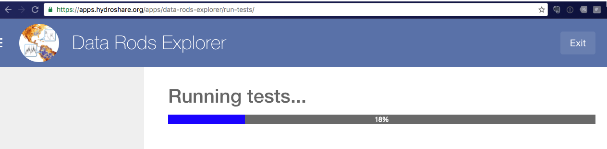

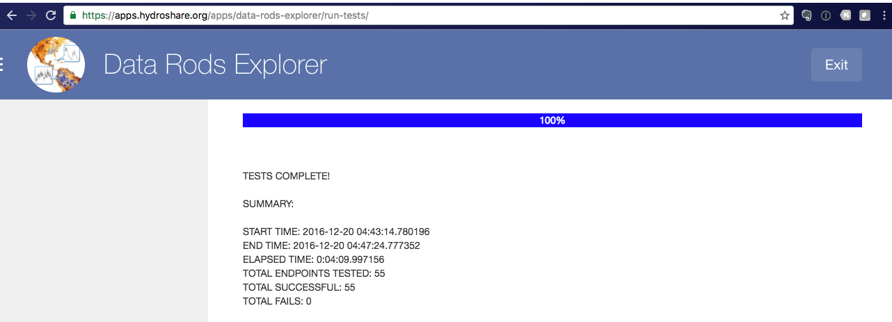

---

## DRE Regression Tests

A set of [DRE Regression Tests](https://github.com/gespinoza/datarodsexplorer/blob/master/DRE-RegressionTests.pdf) have been documented briefly. If a developer makes any significant changes to DRE source code, the developer should verify all prior functionality still exists by running these. If you add functionality, be sure to update the list of tests.

---

## Web App Metadata

_This content is intended for the HydroShare apps registry._

**Title:  Data Rods Explorer**

**Subtitle:** Browse NASA data services for land surface model maps and time series.

**Authors** : Gonzalo Espinoza, David Arctur, Shawn Crawley

**Owners** : Gonzalo Espinoza

**Source repo** : [https://github.com/gespinoza/datarodsexplorer](https://github.com/gespinoza/datarodsexplorer)

**External files used by app** : [https://github.com/gespinoza/datarodsexplorer/blob/master/tethysapp/data\_rods\_explorer/public/data/model\_config.txt](https://github.com/gespinoza/datarodsexplorer/blob/master/tethysapp/data_rods_explorer/public/data/model_config.txt), [https://apps.hydroshare.org/static/data\_rods\_explorer/data/dates\_and\_spatial\_range.txt](https://apps.hydroshare.org/static/data_rods_explorer/data/dates_and_spatial_range.txt)

**Cron job expected by the app** : Python script [enddate\_bounds.py](https://github.com/gespinoza/datarodsexplorer/blob/master/tethysapp/data_rods_explorer/enddate_bounds.py), run nightly at 3am ET, which reads [model\_config.txt](https://github.com/gespinoza/datarodsexplorer/blob/master/tethysapp/data_rods_explorer/public/data/model_config.txt), queries NASA CMR, and updates [dates\_and\_spatial\_range.txt](https://apps.hydroshare.org/static/data_rods_explorer/data/dates_and_spatial_range.txt).

**Keywords** : NASA, time series, data rods, hydrometeorological, land surface model, data assimilation, LDAS, NLDAS, GLDAS, TRMM, LPRM, AMSRE, GRACE, downward radiation flux, precipitation, rain rate, snow rate, soil moisture, surface runoff, subsurface runoff, baseflow, evapotranspiration, soil temperature

**App icons** :      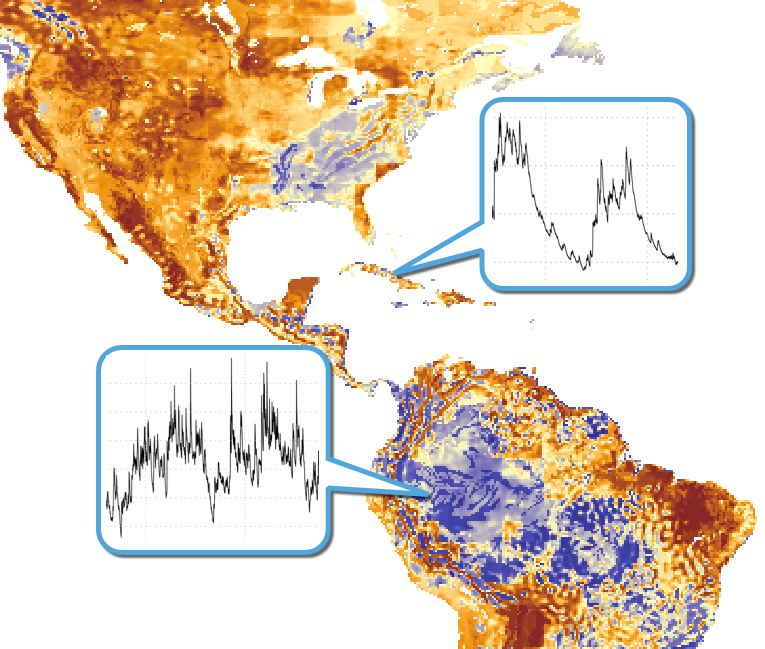

---
